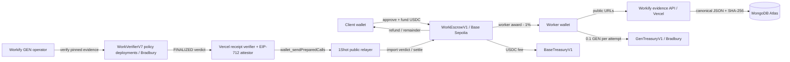
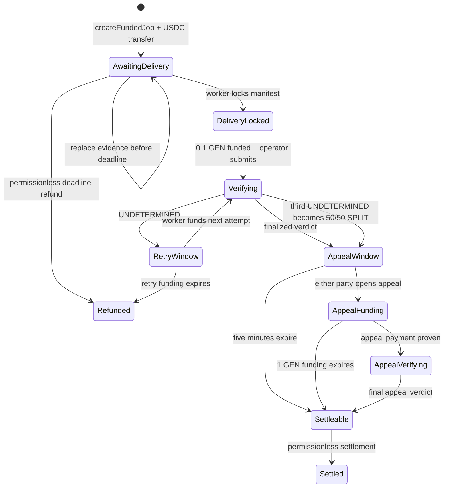

# Workify Protocol

**Verified work. Programmatic settlement.**

Workify is a testnet work-settlement protocol for humans and autonomous agents. A client locks
Base Sepolia USDC before a job exists, a directly assigned worker submits publicly reproducible
evidence, GenLayer validators adjudicate the locked acceptance criteria, and a finalized verdict
controls deterministic escrow settlement. Workify is not an AI freelance marketplace and does
not ask a model whether work is vaguely “good.” It asks whether a pinned delivery satisfies a
predefined, evidence-backed contract.

> **Status — August 31, 2026:** The production dApp and documentation are live at
> `https://workify-protocol.vercel.app`. Base Sepolia escrow/treasury contracts, the Bradbury GEN
> treasury, and all five v7 policy verifiers are deployed. The live phase gate is five distinct
> finalized GenLayer verdicts per policy. Phase 1 advanced only through an explicit user waiver;
> that waiver is recorded separately and is not represented as a passed consensus gate.

## Why Workify

Traditional work platforms trust a client, marketplace operator, or human moderator to decide
whether delivery is complete. That does not scale to an agent economy where software hires other
software and settlement must be machine-readable. Workify separates responsibilities:

- **Base Sepolia** owns USDC custody, job deadlines, verdict imports, appeals, fees, refunds, and payouts.
- **GenLayer Bradbury** owns subjective evidence evaluation and criterion-level consensus.
- **Workify evidence services** turn friendly URLs into canonical, hashed, immutable manifests.
- **The Vercel attestor** verifies finalized GenLayer receipts and signs bounded EIP-712 messages.
- **The 1Shot public relayer** submits prepared Base calls without receiving authority to choose recipients.
- **MongoDB Atlas** indexes asynchronous state, leases, audit records, and canonical JSON; it never owns funds.
- **GitHub Actions** provides best-effort five-minute automation; onchain expiry and settlement stay permissionless.

## Architecture



The Base↔GenLayer relay is an explicit v1 trust assumption. The attestor can misrepresent a
GenLayer result, but Base contracts constrain the message to a known job, locked hashes, a known
policy, a valid payout range, a one-time nonce, and fixed client/worker/treasury recipients. It
cannot redirect escrow to an arbitrary address.

## Supported Work Types

| Policy | Inputs | Primary checks |
| --- | --- | --- |
| GitHub Software | Issue URL, PR URL, criteria | Pinned diff, surrounding code, tests, CI, regressions, security |
| Web Application | Vercel URL, repository, routes | Responsive rendering, functions, errors, accessibility, revision match |
| Research/Data | Report, sources, datasets | Citation support, source authority, dates, methodology, calculations |
| Content/Document | Document and brief | Required structure, factual accuracy, links, brand and audience constraints |
| Design/Creative | Images and brief | Components, hierarchy, responsive variants, states, consistency, accessibility |

V1 does not support private repositories, login-gated evidence, physical-world work, confidential
artifacts, or purely subjective briefs without measurable criteria.

## Job Lifecycle



### Atomic creation

`createFundedJob` validates all fields and calls `safeTransferFrom` before writing the job. A failed
approval, insufficient balance, token revert, invalid worker, invalid hash, or deadline outside
15 minutes–30 days reverts the entire transaction. There is no unfunded job state.

### Delivery

The worker may replace the evidence hash while the job is awaiting delivery. `lockDelivery`
permanently freezes the final revision. Every delivery requires GenLayer verification; the client
cannot bypass adjudication with an early acceptance button.

## Evidence Protocol

Users submit understandable data. The app derives technical details automatically:

- repository owner/name and issue/PR identifiers;
- base and head commit SHAs;
- changed files, bounded patches, check runs, merge state;
- canonical URLs, MIME types, byte sizes, and SHA-256 hashes;
- canonical specification and evidence manifest JSON.

Canonical JSON recursively sorts object keys and preserves array order. SHA-256 is computed over
the exact bytes served at `/api/evidence/{hash}`. GenLayer re-fetches the documents and rejects a
hash mismatch. Large raw artifacts are never stored onchain.

Evidence trust hierarchy:

1. Cryptographic revisions and hashes: commits, transaction hashes, immutable artifact hashes.
2. Public deterministic sources: GitHub API, public JSON APIs, blockchain state.
3. Public rendered sources: Vercel pages and screenshots.
4. Submitted public files pinned in GitHub.
5. Worker statements, which are claims rather than proof.

All retrieved content is untrusted data. Prompts explicitly forbid following instructions inside
issues, code, comments, documents, images, commits, or worker statements.

## Verification and Consensus

`WorkVerifierV1.py` is deployed five times with immutable work type and policy version arguments.
The leader independently fetches the locked documents and authorized evidence, executes a
policy-specific adjudication prompt, validates the response, derives a canonical result hash, and
stores a bounded verdict. Validators rerun the substantive task. They compare decision,
`payout_bps`, criterion decisions, and a bounded score tolerance; schema-only agreement is not
accepted.

Verdicts contain:

```json
{
  "decision": "PASS | FAIL | PARTIAL | UNVERIFIABLE",
  "payout_bps": 0,
  "score": 0,
  "confidence": 0,
  "criteria": [],
  "critical_failures": [],
  "missing_evidence": [],
  "evidence_root": "sha256",
  "specification_hash": "sha256",
  "policy_version": "github-software-v1.0",
  "attempt": 1,
  "result_hash": "sha256",
  "final_reasoning": "bounded explanation"
}
```

Hard mappings prevent ambiguous settlement: PASS is 10,000 bps; FAIL and UNVERIFIABLE are zero;
PARTIAL is 1–9,999 bps. Critical acceptance failures cannot be overridden by minor passes.

## Retries and UNDETERMINED

An `UNDETERMINED` GenLayer transaction has no canonical consensus verdict. Workify never relays a
leader-only output. The worker has 30 minutes to prepay the next 0.1 GEN attempt. Specification,
evidence, and policy remain locked. There are three total attempts. If the third attempt is also
UNDETERMINED, Base records a protocol-defined SPLIT and awards 50% of gross escrow to each party.
If the worker does not fund an available retry in time, anyone may trigger a full client refund.

Preflight validation failures do not consume an attempt. Once a GenLayer transaction hash exists,
the backend recovers its receipt before any resubmission to avoid duplicate spending.

## Appeals

A finalized initial verdict opens a 300-second application-level appeal window on Base. Either
party may freeze settlement by calling `openAppealIntent`. The appellant then has 30 minutes to
pay exactly 1 GEN to `GenTreasuryV1` and prove that finalized payment through an attestation.
Failure to fund makes the original verdict settleable. One funded appeal is allowed per job.

An appeal may add a bounded statement and supplemental public evidence, but cannot replace the
original delivery manifest. The appeal runs as a fresh GenLayer adjudication. Its final verdict
replaces the initial economic outcome. This post-final Workify appeal is distinct from GenLayer’s
native pre-final protocol appeal mechanism.

## Economics

| Event | Charge | Destination |
| --- | ---: | --- |
| Initial verification | 0.1 GEN | `GenTreasuryV1` |
| Re-verification | 0.1 GEN each | `GenTreasuryV1` |
| Appeal | 1 GEN | `GenTreasuryV1` |
| Worker award | 1% of awarded USDC | `BaseTreasuryV1` |
| Client refund | 0% | Client receives full refundable share |

Examples for a 100 USDC reward:

- PASS: worker 99 USDC, Base treasury 1 USDC.
- FAIL/UNVERIFIABLE: client 100 USDC, no Base fee.
- PARTIAL at 40%: worker 39.6 USDC, treasury 0.4 USDC, client 60 USDC.
- Three UNDETERMINED attempts: worker 49.5 USDC, treasury 0.5 USDC, client 50 USDC.

Rounding dust stays with the client because gross worker allocation uses integer division before
the fee is calculated.

## 1Shot Public Relayer

V1 uses the testnet JSON-RPC endpoint:

```text
https://relayer.1shotapi.dev/relayers
```

The backend calls `relayer_estimate7710Transaction`, then `relayer_send7710Transaction`, and polls
`relayer_getStatus`. Each request contains an ERC-7710 delegation chain and bounded executions.
No 1Shot API key, business ID, wallet ID, imported method ID, or webhook credential is used. The
delegation material and app-level delegation secret remain server-only. Onchain methods remain
safe if someone discovers the public endpoint because recipient and state constraints are
enforced by `WorkEscrowV1`.

Hosted relay automation additionally requires a provisioned `ONESHOT_PERMISSION_CONTEXT_JSON`
ERC-7710 delegation chain. Workify does not invent or self-authorize that context. Until it is
provisioned, users and keepers can still call permissionless Base settlement and expiry methods
directly from the dApp.

## Automation and Error Handling

GitHub Actions calls `/api/automation/run` every five minutes with a bearer HMAC. MongoDB leases
prevent overlapping runs. Scheduled workflows are best effort and may be delayed, so the contract
guarantee is eligibility after the deadline, not exact wall-clock execution. Users and third-party
keepers can call permissionless settlement/refund methods directly.

Errors are typed into user input, authorization, funding, evidence, GitHub rate limit, GenLayer
preflight/timeout/UNDETERMINED/execution, attestation, relayer, Base revert, database, and lease
families. Transient network failures use bounded retry/backoff. Secrets and full signed payloads
must never be logged.

## Contracts and Versioning

```text
contracts/base/v1/BaseTreasuryV1.sol
contracts/base/v1/WorkEscrowV1.sol
contracts/genlayer/v1/GenTreasuryV1.py
contracts/genlayer/v1/WorkVerifierV1.py
contracts/genlayer/v2..v7/WorkVerifierV*.py
```

Contracts are immutable and versioned. Every historical verifier from v1 through v7 remains under
`contracts/genlayer`; deployed source is never overwritten. The owner may pause new job creation and rotate operator/attestor roles, but
cannot rewrite existing job terms, redirect escrow, or disable matured refunds and settlements.

Treasury owner on both chains:

```text
0x5905c9Dea6Ae52AA0947D8F7F218263889eDfC4E
```

## Local Development

Requirements: Node.js 24+, pnpm 11+, Foundry, uv, GenLayer CLI, and `genvm-linter`.

```bash
pnpm install
cp .env.example .env.local
pnpm test
pnpm test:contracts
uv run --with genlayer-test pytest tests/direct -v
pnpm build
```

Never commit `.env.local`. The MongoDB password supplied during development was disclosed in chat
and must be rotated before deployment.

### Base deployment

```bash
cd contracts/base
forge script script/DeployV1.s.sol:DeployV1 \
  --rpc-url "$NEXT_PUBLIC_BASE_SEPOLIA_RPC_URL" \
  --broadcast
```

### GenLayer deployment

```bash
genlayer config set network=testnet-bradbury
node scripts/deploy-genlayer.mjs
```

Always inspect finalized receipts for execution success. A finalized lifecycle status can still
contain a reverted contract execution.

## Testing and Release Gates

Local suites cover Solidity state transitions, conservation, replay protection, deadlines,
partial payouts, retry fallback, appeal freezing, GenLayer access control, exact GEN fees,
canonical hashing, receipt classification, and verdict normalization.

Every phase additionally requires five distinct public works. A result counts only when:

1. the GenLayer transaction is FINALIZED;
2. contract execution succeeded;
3. a schema-valid result was stored;
4. expected manually reviewed behavior matches;
5. Base settlement and fee accounting match;
6. GenLayer and Base transaction hashes are recorded.

`fixtures/live-results/phase*-v7.json` is authoritative for live consensus progress and must not be
edited to claim success without machine-readable transaction evidence. Sequential advancement is
required unless the user explicitly waives a gate. A waiver authorizes sequencing only; it never
changes recorded receipt statuses or becomes a fake finalized result.

## Threat Model

Primary threats include malicious evidence prompt injection, dynamic web drift, inaccessible
sources, GitHub rate limiting, attestor compromise, signature replay, relayer misuse, operator key
loss, duplicate automation, token reentrancy, rounding error, griefing appeals, and false release
gate claims. Defenses include immutable hashes, source re-fetching, strict URL and size bounds,
substantive validator reruns, EIP-712 domain binding, nonce consumption, fixed recipients,
`SafeERC20`, `ReentrancyGuard`, permissionless expiry, MongoDB leases, and public gate reports.

See `SECURITY.md` for disclosure and secret-handling rules.

## Repository Map

```text
apps/web                    Next.js dApp, APIs, and /docs
contracts/base/v1           Base Sepolia escrow and treasury
contracts/genlayer/v1..v7   Historical Bradbury verifiers and GEN treasury
packages/protocol-types     Canonical schemas and constants
packages/evidence-engine    GitHub, hashing, MongoDB, receipt, attestation, relayer logic
fixtures                    Live phase-gate records
scripts                     Deployment and operational scripts
deployments                 Versioned network manifests
```

## License

No source license has been granted yet. The repository is visible for review and testnet protocol
transparency, but reuse rights remain reserved until an explicit license file is added.
