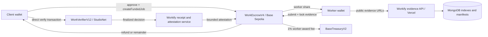

# Workify Protocol

**Evidence-backed work settlement for humans and autonomous agents.**

Workify is a testnet protocol for creating funded work contracts, locking public evidence,
asking GenLayer to adjudicate the evidence against immutable acceptance criteria, and settling
Base Sepolia USDC according to the finalized decision. It is not a generic marketplace and it
does not ask an LLM whether work is vaguely “good.” It evaluates whether a pinned delivery
satisfies a predefined specification.

> **Active release — September 12, 2026**
>
> The active Base deployment is `WorkEscrowV4` with `BaseTreasuryV2`. The active GenLayer
> policy deployments are `WorkVerifierV12` on StudioNet. Verification and appeals are zero-fee
> direct-wallet calls in the active StudioNet flow. Historical contracts remain in the repository
> for reproducibility but are not selected by the active application configuration.

## Product model

```text
Client creates and funds a work contract on Base Sepolia
        ↓
Assigned worker submits and locks a canonical evidence manifest
        ↓
Client starts one direct GenLayer V12 review from the connected wallet
        ↓
GenLayer validators evaluate the locked specification and evidence
        ↓
Final verdict opens a five-minute appeal window
        ↓
PASS / PARTIAL → worker payout
FAIL / UNVERIFIABLE → client refund
Appeal → appeal verdict replaces the initial verdict
```

The escrow contract remains the only USDC custodian. GenLayer evaluates evidence; it does not
hold or transfer Base funds. The Vercel automation signer is an optional keeper for bounded
Base lifecycle calls and cannot choose payout recipients.

## Architecture



### Trust boundaries

- **Base Sepolia:** custody, job state, deadlines, replay protection, appeal freezing, payouts,
  refunds, and treasury accounting.
- **GenLayer StudioNet:** independent policy execution and evidence adjudication. The V12
  verifier independently retrieves authorized public evidence and stores a normalized verdict.
- **Workify/Vercel:** canonicalizes evidence, tracks asynchronous receipts, verifies finality,
  and may submit bounded attestations. MongoDB is an index and lease store only.
- **Connected wallets:** sign funding, delivery, and direct GenLayer review transactions. No
  client delegation or 1Shot secret is required for the active flow.

## Active deployments

### Base Sepolia (`84532`)

| Component | Address | Deployment |
| --- | --- | --- |
| `WorkEscrowV4` | `0x4b7Fc39D747461115B351c64368987354f5f0457` | block `46704733` |
| `BaseTreasuryV2` | `0xf5772D2A3B9493d94107a0328AF48D17144Ae843` | block `46704733` |
| USDC | `0x036CbD53842c5426634e7929541eC2318f3dCF7e` | canonical Base Sepolia USDC |

`WorkEscrowV4` uses EIP-712 domain version `3`, has an explicit `AppealResolved` event, and
contains the active payout and retry state machine.

### GenLayer StudioNet

| Policy | Address | Immutable policy |
| --- | --- | --- |
| GitHub Software | `0x0370eAD9bADd7Ea57129716e85E30c8aF61d0d15` | `github-software-v12.0` |
| Web Application | `0x62B486f95563D18d03a3f46Cb312297d3e1dAA69` | `web-application-v12.0` |
| Research/Data | `0x34E5C2Fa49aa22213cB044491e7DB9A7e9896D21` | `research-data-v12.0` |
| Content/Document | `0x12E3944187702cD4127B30451A0aA31d5408346E` | `content-document-v12.0` |
| Design/Creative | `0xb276C4F8ea32A170247Ea0B3C4C9686E41032f26` | `design-creative-v12.0` |

Endpoint: `https://studio.genlayer.com/api`.

## Why contracts are versioned

Deployed smart contracts and intelligent contracts are immutable protocol artifacts. Workify
never overwrites a deployed version in place. A new version is created when storage layout,
signing domains, state transitions, verifier output, policy prompts, or integration guarantees
change.

- **Base V1–V3:** historical escrow iterations used for earlier testnet records and regression
  analysis.
- **Base V4:** current escrow. It preserves the hardened funding, token accounting, retry,
  appeal, and attestation controls while moving the EIP-712 domain to version `3` and exposing
  appeal-finalization provenance.
- **GenLayer V1–V11:** historical verifier and policy iterations.
- **GenLayer V12:** current verifier. It normalizes `verdict_available`, `execution`, and
  `consensus_requirement` fields so asynchronous UI and receipt processing can distinguish a
  finalized result from a transaction that merely reached acceptance.

Old source remains under its versioned directory so auditors can reproduce historical bytecode
and understand migration boundaries. The application selects only V4/V12 addresses.

## Lifecycle and state machine

1. `createFundedJob` atomically transfers the exact USDC reward and stores the specification and
   policy hashes. An unfunded job cannot exist.
2. The assigned worker calls `submitOrReplaceDelivery` and then `lockDelivery`. The evidence hash
   becomes immutable for the review attempt.
3. The client starts `requestVerification(jobId, false)` through the active operator path after
   the delivery is locked. The direct StudioNet review transaction is signed by the user wallet.
4. A finalized GenLayer result is imported through a bounded EIP-712 attestation, or an
   `UNDETERMINED` result opens a retry window. There are at most three attempts.
5. A terminal verdict enters the five-minute appeal window. Either client or worker may call
   `openAppealIntent` once. Appeal verification freezes settlement until it resolves.
6. After the appeal window, anyone may call `settle`. A keeper may do so automatically, but the
   contract derives every recipient and amount from the stored job.

### Settlement semantics

| Decision | Worker | Client | Treasury |
| --- | --- | --- | --- |
| `PASS` | 100% less 1% protocol fee | none | 1% of worker award |
| `PARTIAL` | adjudicated basis points less 1% fee | remainder | 1% of worker award |
| `FAIL` | none | full reward | none |
| `UNVERIFIABLE` | none | full reward | none |
| terminal fallback | 50% less fee | 50% remainder | 1% of worker award |

The escrow rejects invalid payout ranges, replayed nonces, mismatched hashes, unauthorized
attestors, wrong attempts, wrong appeal state, and unsupported token behavior. `SafeERC20`,
reentrancy guards, deadline checks, and fixed recipients protect the custody boundary.

## Evidence requirements

Evidence must be publicly reproducible by independent validators. Supported evidence includes
public GitHub repositories and pull requests, public Vercel/web URLs, public documents, public
datasets, and stable image/document URLs. Private dashboards, login-gated drives, private social
posts, physical-world claims, and purely subjective briefs are not directly verifiable.

Workify stores canonical manifests containing source URLs, MIME type, byte bounds, revision data,
and SHA-256 hashes. External content is untrusted data; it is never treated as an instruction.
Validators extract stable fields and independently rerun substantive checks instead of agreeing
only that a leader returned valid JSON.

## Retries and appeals

An `UNDETERMINED` result is not a pass or fail. The worker may request re-verification using the
same locked evidence, up to a maximum of three attempts. If the second attempt is also
`UNDETERMINED`, the second undetermined result is the deterministic fallback required by the
protocol. The third attempt remains the hard cap for all review paths.

Appeals are available for five minutes after a terminal initial verdict. Opening an appeal freezes
settlement. The appeal uses the same V12 evidence discipline and may produce a replacement PASS,
PARTIAL, FAIL, UNVERIFIABLE, or terminal fallback decision. `AppealResolved` makes that replacement
visible to indexers and the public explorer.

## Security model

- EIP-712 signatures bind chain ID, escrow address, job ID, verifier, evidence, policy, decision,
  attempt, appeal state, and a one-time nonce.
- The Vercel signer is server-only and can submit only allowlisted lifecycle methods. It never
  accepts arbitrary payout recipients or arbitrary calldata.
- The web client validates chain, account, job state, duplicate submission keys, and transaction
  receipts before advancing the UI.
- MongoDB records are advisory and rebuildable. Onchain state is authoritative for custody and
  settlement.
- All user-facing asynchronous states distinguish wallet signing, transaction confirmation,
  GenLayer acceptance, GenLayer finality, attestation, and Base settlement.

## Local development

Requirements: Node.js 24+, pnpm 11+, Foundry, `genvm-lint`, and the GenLayer CLI.

```bash
pnpm install
cp .env.example .env.local
pnpm lint
pnpm typecheck
pnpm test
pnpm test:contracts
pnpm test:genlayer
pnpm build
```

Never commit `.env.local`, deployment private keys, MongoDB credentials, or Vercel secrets.
`BASE_AUTOMATION_PRIVATE_KEY` is server-only. The active EIP-712 setting is:

```text
WORKIFY_EIP712_VERSION=3
```

### Deploy Base V4

```bash
cd contracts/base
forge script script/DeployV4.s.sol:DeployV4 \
  --rpc-url "$BASE_SEPOLIA_RPC_URL" \
  --broadcast
```

### Deploy GenLayer V12

```bash
pnpm deploy:genlayer:v12
```

The deployment script validates all five verifier schemas and writes a versioned manifest under
`deployments/genlayer-studionet/`. Addresses in production must match the manifest and must never
be inferred from a client-controlled request.

## Testing and release gates

The local suites cover atomic funding, fee-on-transfer rejection, conservation, replay
protection, invalid signatures, deadline transitions, partial payouts, retries, appeals, receipt
classification, canonical evidence hashing, and direct-wallet duplicate protection.

A live verification is counted only when the GenLayer transaction is finalized, execution
succeeded, the V12 result schema is non-empty, the Base attestation is accepted, and the escrow
settlement receipt is confirmed. An accepted-but-not-finalized transaction is never presented as
a verdict. No fixture data is used by the public explorer.

## Repository map

```text
apps/web                    Next.js dApp, API routes, explorer, and docs
contracts/base/v1..v4       Versioned Base escrow and treasury sources
contracts/genlayer/v1..v12  Historical and active GenLayer verifier sources
packages/evidence-engine    Evidence, receipts, attestation, automation, and MongoDB adapters
deployments                 Immutable network deployment manifests
tests                       GenLayer direct/integration tests
docs                        Protocol and UX audit material
```

## License

No source license has been granted yet. The repository is available for testnet review and
protocol transparency; reuse rights remain reserved until an explicit license is added.
